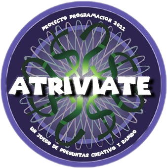
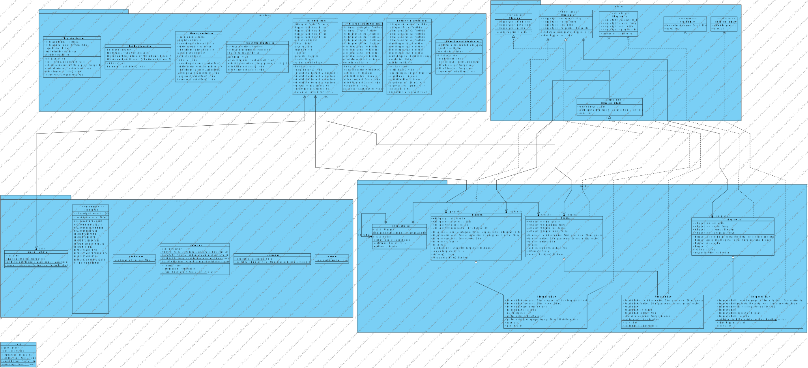
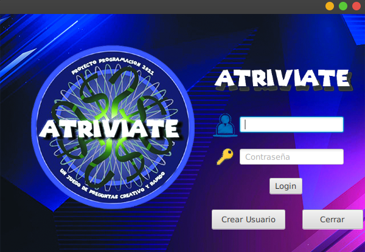
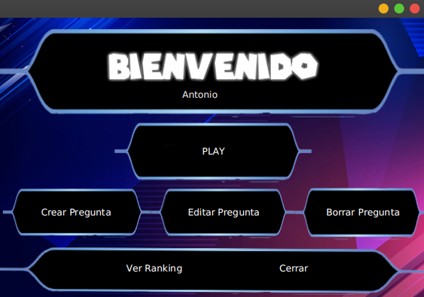
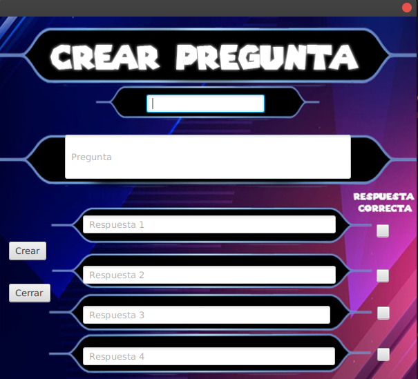
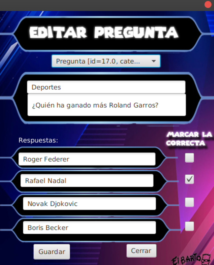
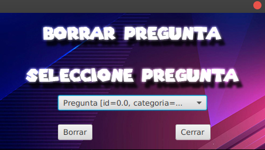
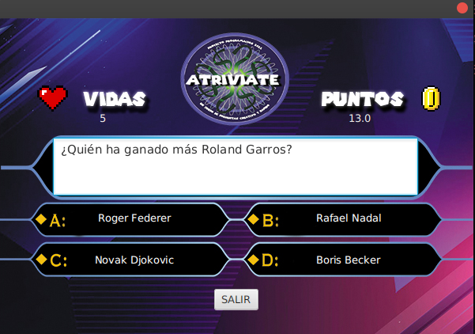

<!--
*** Thanks for checking out the Best-README-Template. If you have a suggestion
*** that would make this better, please fork the repo and create a pull request
*** or simply open an issue with the tag "enhancement".
*** Thanks again! Now go create something AMAZING! :D
***
***
***
*** To avoid retyping too much info. Do a search and replace for the following:
*** github_username, repo_name, twitter_handle, email, project_title, project_description
-->


<!-- PROJECT SHIELDS -->
<!--
*** I'm using markdown "reference style" links for readability.
*** Reference links are enclosed in brackets [ ] instead of parentheses ( ).
*** See the bottom of this document for the declaration of the reference variables
*** for contributors-url, forks-url, etc. This is an optional, concise syntax you may use.
*** https://www.markdownguide.org/basic-syntax/#reference-style-links
-->
[![Contributors][contributors-shield]][contributors-url]
[![Forks][forks-shield]][forks-url]
[![Stargazers][stars-shield]][stars-url]
[![Issues][issues-shield]][issues-url]
[![MIT License][license-shield]][license-url]
<!-- [![LinkedIn][linkedin-shield]][linkedin-url] -->


<!-- PROJECT LOGO -->
<br />
<p align="center">
  <a href="https://github.com/ErTonix12/Atriviate">
    
  </a>

  <h1 align="center">Atriviate</h1>


  <p align="center">
    Es una pequeña aplicación desarrollada en java, que se conecta a una base de datos MySQL y cuya interfaz gráfica está desarrollada con JavaFX
    <br />
    <a href="https://drive.google.com/file/d/1U8yCyXT1qgdzbAUa2i-hd-2fBYbiVee_/view?usp=sharing"><strong>« Explore the docs »</strong></a>
    <br />
    <br />
    <a href="#usage">View Demo</a>
    ·
    <a href="https://github.com/ErTonix12/Atriviate/issues">Report Bug</a>
    ·
    <a href="https://github.com/ErTonix12/Atriviate/issues">Request Feature</a>
  </p>
</p>


<!-- TABLE OF CONTENTS -->
<details open="open">
  <summary><h2 style="display: inline-block">Table of Contents</h2></summary>
  <ol>
    <li>
      <a href="#about-the-project">About The Project</a>
      <ul>
        <li><a href="#built-with">Built With</a></li>
      </ul>
    </li>
    <li>
      <a href="#getting-started">Getting Started</a>
      <ul>
        <li><a href="#prerequisites">Prerequisites</a></li>
        <li><a href="#installation">Installation</a></li>
      </ul>
    </li>
    <li><a href="#usage">Usage</a></li>
    <li><a href="#roadmap">Roadmap</a></li>
    <li><a href="#contributing">Contributing</a></li>
    <li><a href="#license">License</a></li>
    <li><a href="#contact">Contact</a></li>
    <li><a href="#acknowledgements">Acknowledgements</a></li>
  </ol>
</details>


<!-- ABOUT THE PROJECT -->
## About The Project

Esta aplicación está desarrollada para la asignatura de Programación del ciclo superior de Desarrollo de Aplicaciones Multiplataforma del instituto
<a href="https://github.com/ies-franciscodelosrios">I.E.S Francisco de los Ríos</a>

Consiste en un juego de preguntas y respuestas que incluye un CRUD para crear, editar, borrar y leer las preguntas de una base de datos, teniendo un 
ranking de usuarios regido por el puntuaje obtenido al superar las preguntas.

El diagrama de flujo sería el siguiente

  <a href="https://github.com/ErTonix12/Atriviate">
    
    <h6>Flowchart</h6>
  </a>

El diagrama de clases sería el siguiente

  <a href="https://raw.githubusercontent.com/ErTonix12/Atriviate/b8ed83a71904a78bbb5596133c101d95887adc08/images/es.antoniomc.Atriviate.svg">
    
    <h6>Class Diagram</h6>
  </a>

### Built With
Proyecto desarrollado en Eclipse usando Maven.

<!-- GETTING STARTED -->
## Getting Started

Pequeña aplicación que permite la adminstración de usuarios, así como la gestión de preguntas (creación, modificación y borrado) de las mismas, permitiendo un juego simple de preguntas y respuestas. 

Para más información, puedes consultar la documentación en el siguiente enlace: _[Documentation](https://drive.google.com/file/d/1U8yCyXT1qgdzbAUa2i-hd-2fBYbiVee_/view?usp=sharing)_


### Prerequisites

Java 1.8 o superior
* npm
  ```sh
  sudo apt install openjdk-11-jdk
  ```

### Installation

1. Clone the repo
   ```sh
   git clone https://github.com/ErTonix12/Atriviate.git
2. run the jar
   ```sh
   java -jar ejecutable.jar
   ```


<!-- USAGE EXAMPLES -->
## Usage

El uso de la aplicación es muy intuitivo, en primer lugar, tenemos una pantalla de _Login_ en la que introduciremos nuestro usuario y contraseña en caso de que ya lo tengamos o pulsamos en _Crear Usuario_ para registrarnos.

  <a>
    
    <h6>Pantalla de Login</h6>
  </a>

Una vez dentro del menú podemos observar varias opciones:

  <a>
    
    <h6>Pantalla del Menú</h6>
  </a>

Si hacemos click en el apartado de crear pregunta, se nos abrirá una pequeña ventana para que introduzcamos la información de la pregunta que vamos a crear. Esta consta de: El primer campo es una categoría, seguido de la pregunta y sus respuestas que para marcar cual o cuales son correctas, simplemente marcamos los CheckBoxs.

  <a>
    
    <h6>Pantalla de creación de Pregunta</h6>
  </a>

El apartado de editar es muy parecido al anterior, en el cual nos encontramos un selector para seleccionar la pregunta de deseemos actualizar y simplemente sería actualizar los campos que requiramos y darle al botón de guardar.

  <a>
    
    <h6>Pantalla de edición de Pregunta</h6>
  </a>

El borrado de las preguntas no deseadas es de los más intuitivo, simplemente seleccionamos las pregunta deseada y pulsamos borrar.

  <a>
    
    <h6>Pantalla de borrado de Pregunta</h6>
  </a>

El botón de ranking simplente muestra los usuarios registrados con sus correspondiente puntuación.

El apartado _Play_ es el juego en sí. Tendremos 5 vidas, que se irán restando conforme fallemos preguntas, en el momento que se agontes nuestas vidas, no podremos continuar y tendremos que empezar desde 0. Irán apareciendo preguntas de forma aleatoria.

  <a>
    
    <h6>Pantalla de Play</h6>
  </a>

Una vez cerremos dicha pantalla todo se quedará guardado en la base de datos.


<!-- ROADMAP -->
## Roadmap

See the [open issues](https://github.com/ErTonix12/Atriviate/issue) for a list of proposed features (and known issues).


<!-- CONTRIBUTING -->
## Contributing

Contributions are what make the open source community such an amazing place to be learn, inspire, and create. Any contributions you make are **greatly appreciated**.

1. Fork the Project
2. Create your Feature Branch (`git checkout -b feature/AmazingFeature`)
3. Commit your Changes (`git commit -m 'Add some AmazingFeature'`)
4. Push to the Branch (`git push origin feature/AmazingFeature`)
5. Open a Pull Request


<!-- LICENSE -->
## License

Distributed under the MIT License. See `LICENSE` for more information.


<!-- CONTACT -->
## Contact

Antonio Muñoz - [@ToniMC12](https://twitter.com/tonimc12)

Project Link: [https://github.com/ErTonix12/Atriviate](https://github.com/ErTonix12/Atriviate)


<!-- ACKNOWLEDGEMENTS -->
## Acknowledgements

* [Miguel Ángel García Mérida](https://github.com/Abepuoh)


<!-- MARKDOWN LINKS & IMAGES -->
<!-- https://www.markdownguide.org/basic-syntax/#reference-style-links -->
[contributors-shield]: https://img.shields.io/github/contributors/ErTonix12/Atriviate.svg?style=for-the-badge
[contributors-url]: https://github.com/ErTonix12/Atriviate/graphs/contributors
[forks-shield]: https://img.shields.io/github/forks/ErTonix12/Atriviate.svg?style=for-the-badge
[forks-url]: https://github.com/ErTonix12/Atriviate/network/members
[stars-shield]: https://img.shields.io/github/stars/ErTonix12/Atriviate.svg?style=for-the-badge
[stars-url]: https://github.com/ErTonix12/Atriviate/stargazers
[issues-shield]: https://img.shields.io/github/issues/ErTonix12/Atriviate.svg?style=for-the-badge
[issues-url]: https://github.com/ErTonix12/Atriviate/issues
[license-shield]: https://img.shields.io/github/license/ErTonix12/Atriviate.svg?style=for-the-badge
[license-url]: https://github.com/ErTonix12/Atriviate/blob/master/LICENSE.txt
[linkedin-shield]: https://img.shields.io/badge/-LinkedIn-black.svg?style=for-the-badge&logo=linkedin&colorB=555
[linkedin-url]: https://linkedin.com/in/github_username
